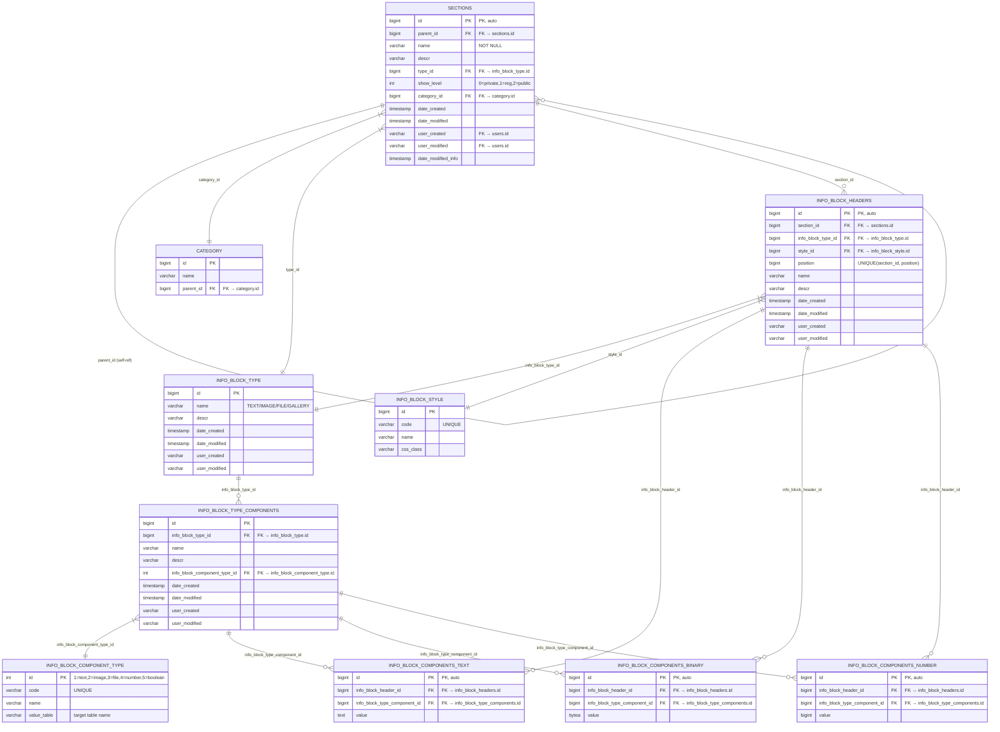
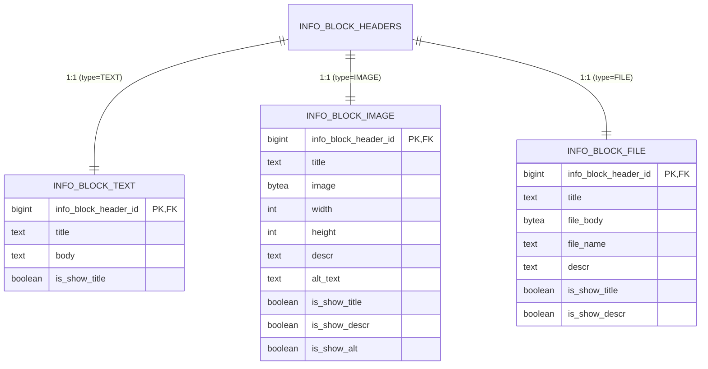

# Database Schema Diagram



---

## Legend

| Symbol | Meaning |
|--------|---------|
| `||--o{` | One-to-Many (parent → children) |
| `}|--||` | Many-to-One (child → parent) |
| `PK` | Primary Key |
| `FK` | Foreign Key (logical, not yet created in DB) |
| `UNIQUE` | Unique constraint |

---

## Missing Tables (referenced but not defined)

| Table | Referenced by |
|-------|---------------|
| `category` | `sections.category_id` |
| `info_block_style` | `info_block_headers.style_id` |
| `info_block_component_type` | `info_block_type_components.info_block_component_type_id` |
| `users` | `sections.user_created`, `sections.user_modified`, etc. |

---

## Current Issues Visualized

```
┌─────────────────────────────────────────────────────────────┐
│  ❌ NO FK CONSTRAINTS EXIST IN CURRENT SCHEMA               │
│  ❌ DUPLICATE date_modified in SECTIONS (line 11 & 15)      │
│  ❌ EAV PATTERN: 3 separate value tables                    │
│  ❌ user_created/modified = varchar(30) not FK to users     │
│  ❌ No UNIQUE(section_id, position) on info_block_headers   │
└─────────────────────────────────────────────────────────────┘
```

---

## Recommended Refactored Structure (Concrete Tables)



> **Benefit**: Eliminates EAV, enables NOT IN complexity, allows proper constraints, indexes, and simple JOINs.